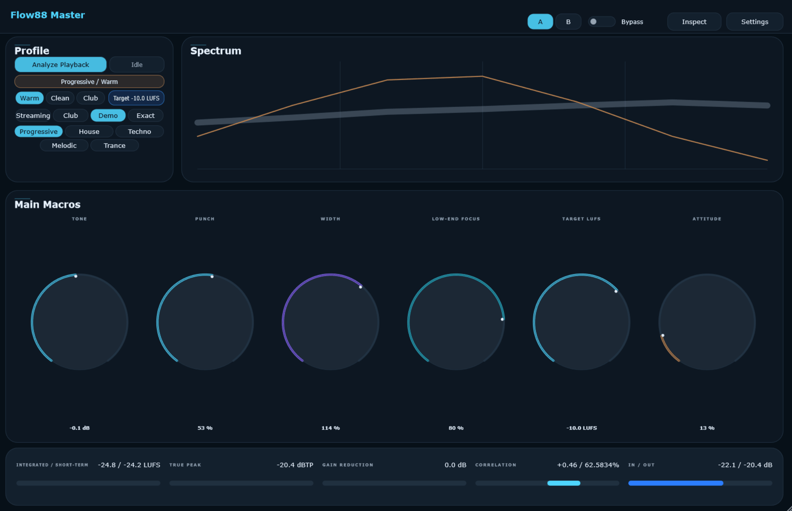
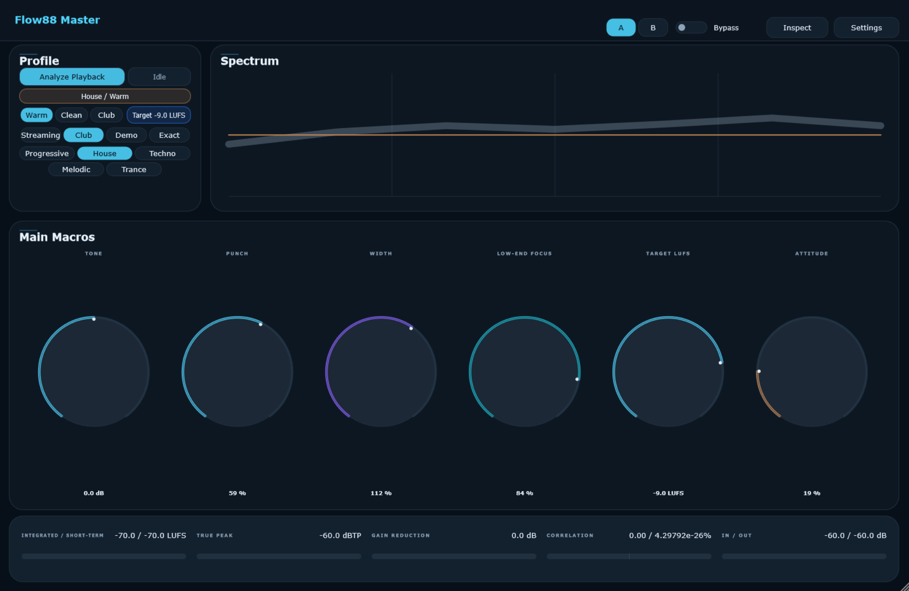

# Flow88 Mastering

A simple Windows VST3 mastering plugin for electronic music producers.







## What it is
Flow88 Mastering is a small Windows VST3 mastering plugin I built with AI-assisted development. It gives electronic music producers a simple master-bus tool with metering, tone shaping, width, saturation, clipping/limiting, presets, and A/B comparison. It works, but it is still early and experimental.

## What it does
- master-bus tone shaping
- low-end control
- stereo width
- saturation / clipping / limiting
- basic loudness/peak/correlation metering
- genre/style starting points
- A/B comparison
- reference import if currently working

## What it is not
- not a replacement for a professional mastering engineer
- not a finished commercial plugin
- not guaranteed to make every track sound better
- Windows/VST3 only for now

## Install from release
1. Go to Releases
2. Download Flow88Mastering-Windows-VST3.zip
3. Unzip it
4. Copy the .vst3 into:
   `C:\Program Files\Common Files\VST3`
5. Rescan plugins in your DAW

## Build from source
If you want to compile Flow88 Master from the source code, follow these steps:

### Requirements
- Windows 10/11
- CMake 3.22+
- Visual Studio 2022 (with "Desktop development with C++" workload)
- JUCE 8.0.12 (You can place it in a local `JUCE/` folder or set the `JUCE_DIR` environment variable).

### Building
Alternatively, build manually via CMake:
```powershell
cmake -S . -B build -G "Visual Studio 17 2022"
cmake --build build --config Release --parallel
```
The compiled plugin will be located at `build/Flow88Master_artefacts/Release/VST3/Flow88 Master.vst3`.

## YouTube / development story
This was built as part of a YouTube/video project showing how I used AI tools to design, code, debug, and iterate on a real audio plugin.

## Current status
Early public release.
Works on my setup.
Needs more testing across DAWs/systems.

## Roadmap
- better installer
- more DAW testing
- improved limiter behavior
- clearer presets
- macOS support maybe later

## License
MIT.
